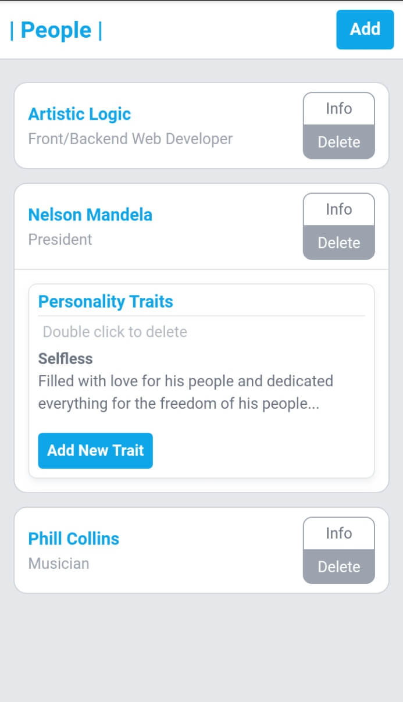

#### Vuejs with localStorage (People App)
This is an implementation on how html5 localStorage API can be used with vuejs to dynamically store data.
Example was implemented on a 'people list app' where a user can;
- Add, retrieve and delete people data from list.
- Add personality traits to a person, relationally(trait belongs to person).

Feel free to fork and add to this repo.

